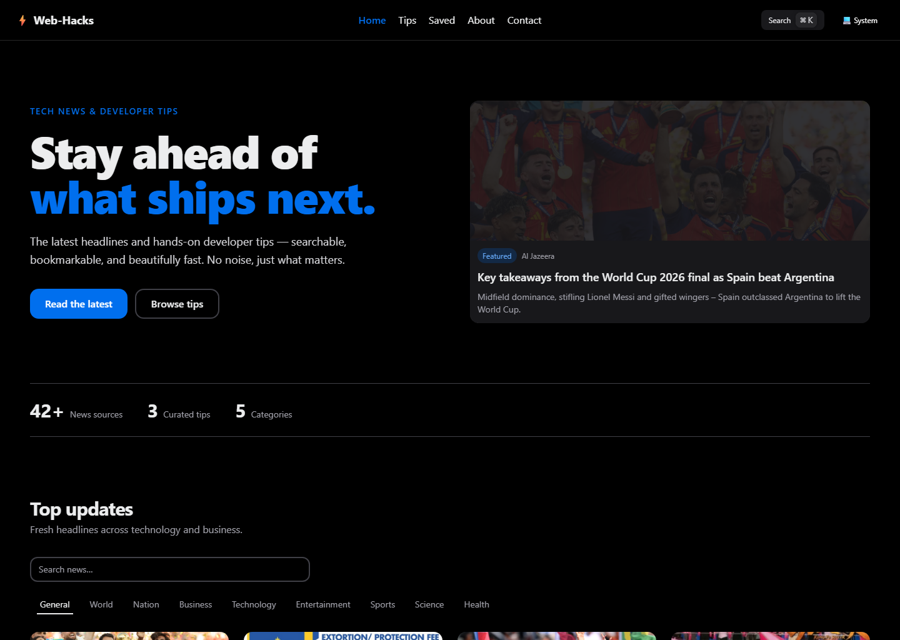
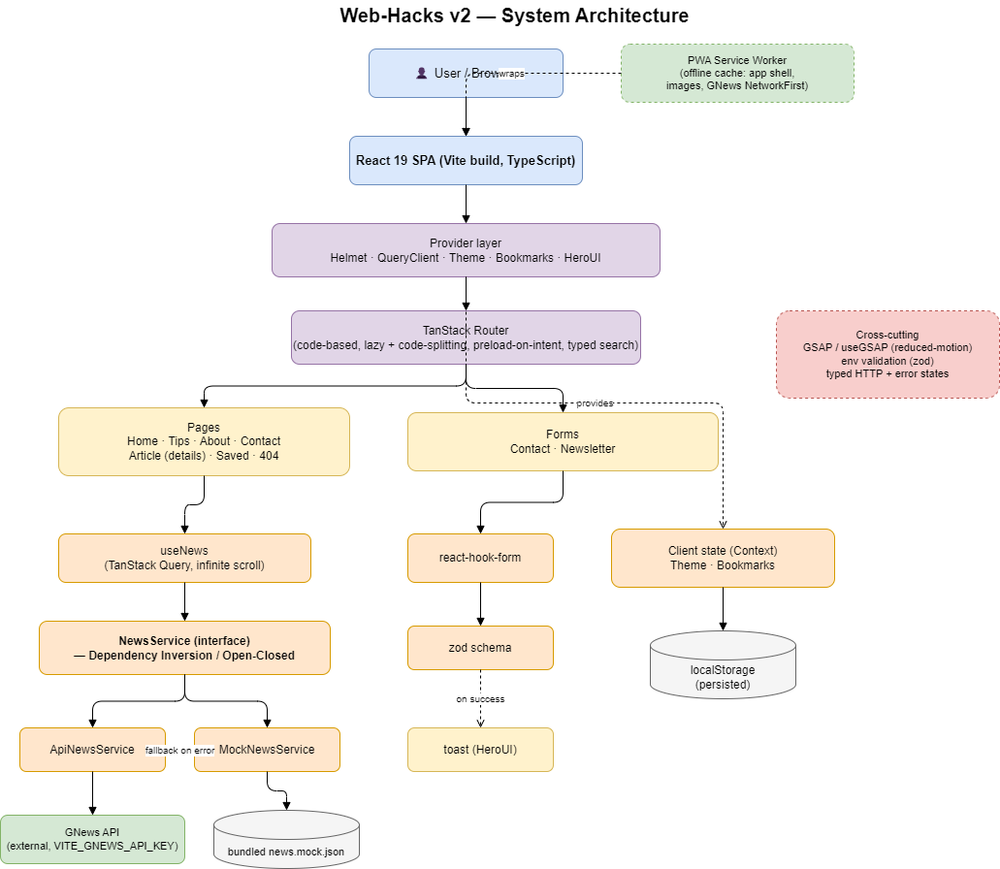

<a id="readme-top"></a>

[![Contributors][contributors-shield]][contributors-url]
[![Forks][forks-shield]][forks-url]
[![Stargazers][stars-shield]][stars-url]
[![Issues][issues-shield]][issues-url]
[![MIT License][license-shield]][license-url]
[![LinkedIn][linkedin-shield]][linkedin-url]

<div align="center">
  <h1>Web-Hacks</h1>
  <p><b>A fast, modern tech-news &amp; developer-tips app — searchable, bookmarkable, and installable.</b></p>
  <p>
    <a href="https://github.com/omunite215/Project_WebHacks/issues/new?labels=bug">Report Bug</a>
    &nbsp;·&nbsp;
    <a href="https://github.com/omunite215/Project_WebHacks/issues/new?labels=enhancement">Request Feature</a>
  </p>
</div>

<details>
  <summary>Table of Contents</summary>
  <ol>
    <li><a href="#about-the-project">About The Project</a>
      <ul><li><a href="#built-with">Built With</a></li></ul>
    </li>
    <li><a href="#architecture">Architecture</a></li>
    <li><a href="#features">Features</a></li>
    <li><a href="#getting-started">Getting Started</a>
      <ul>
        <li><a href="#prerequisites">Prerequisites</a></li>
        <li><a href="#installation">Installation</a></li>
      </ul>
    </li>
    <li><a href="#usage">Usage</a></li>
    <li><a href="#roadmap">Roadmap</a></li>
    <li><a href="#contributing">Contributing</a></li>
    <li><a href="#license">License</a></li>
    <li><a href="#contact">Contact</a></li>
    <li><a href="#acknowledgments">Acknowledgments</a></li>
  </ol>
</details>

## About The Project

<p align="center"></p>

Web-Hacks is a single-page app for reading the latest technology headlines and
curated developer tips. It started as an old Create React App project and was
rebuilt from the ground up on a Bun + Vite + React 19 + TypeScript stack, with a
HeroUI/Tailwind interface and GSAP micro-interactions.

News is fetched from GNews through a small service layer that falls back to
bundled sample data, so the app runs fully even without an API key. Bookmarks,
theme, and reading state are kept on the device — there is no backend and no
sign-in.

<p align="right">(<a href="#readme-top">back to top</a>)</p>

### Built With

[![React][React-badge]][React-url]
[![TypeScript][TS-badge]][TS-url]
[![Vite][Vite-badge]][Vite-url]
[![Bun][Bun-badge]][Bun-url]
[![Tailwind][TW-badge]][TW-url]
[![TanStack][TanStack-badge]][TanStack-url]
[![GSAP][GSAP-badge]][GSAP-url]
[![Vitest][Vitest-badge]][Vitest-url]

Also uses HeroUI (components), TanStack Router (routing), TanStack Query (data),
react-hook-form + zod (forms), and vite-plugin-pwa (offline / installable).

<p align="right">(<a href="#readme-top">back to top</a>)</p>

## Architecture

The browser runs a static React bundle wrapped in a provider stack (theme, data,
bookmarks, UI). News flows through a `NewsService` interface with two
implementations — a live GNews client and a bundled-mock client — selected by a
factory, with automatic fallback to mock data on any failure. Forms validate
with zod; theme and bookmarks persist to `localStorage`; a service worker handles
offline caching.

<p align="center"></p>

<p align="right">(<a href="#readme-top">back to top</a>)</p>

## Features

- Live tech news with search and category filtering, kept in the URL
- Infinite scroll powered by TanStack Query
- In-app article details page, with a link back to the original source
- Bookmarks and a dedicated **Saved** page (stored on the device)
- Command palette (`Ctrl`/`Cmd` + `K`) to jump around and search
- Light / dark / system theme that remembers your choice
- Installable PWA with offline caching of the app shell and recent news
- Validated Contact and Newsletter forms (react-hook-form + zod)
- GSAP micro-interactions that respect `prefers-reduced-motion`
- Skeleton loading, empty, and error states throughout
- Route-level code-splitting with preload-on-hover

<p align="right">(<a href="#readme-top">back to top</a>)</p>

## Getting Started

### Prerequisites

- [Bun](https://bun.sh) 1.3 or newer

### Installation

1. Clone the repo
   ```sh
   git clone https://github.com/omunite215/Project_WebHacks.git
   cd Project_WebHacks
   ```
2. Install dependencies
   ```sh
   bun install
   ```
3. (Optional) Add a GNews key for live headlines
   ```sh
   cp .env.example .env
   # then set VITE_GNEWS_API_KEY in .env
   ```
4. Start the dev server
   ```sh
   bun run dev
   ```

The app runs at `http://localhost:5173`. Without a key it uses bundled sample
news, so everything works out of the box.

<p align="right">(<a href="#readme-top">back to top</a>)</p>

## Usage

Browse the feed on the home page, filter by category or search, and scroll to
load more. Click any card to open its details page, bookmark stories to read
later on the **Saved** page, and press `Ctrl`/`Cmd` + `K` for quick navigation.

For live headlines, get a free key at [gnews.io](https://gnews.io/register) and
put it in `.env` as `VITE_GNEWS_API_KEY`. If the key is missing or a request
fails, the app falls back to bundled data automatically.

Common scripts:

| Command | Description |
| --- | --- |
| `bun run dev` | Start the dev server |
| `bun run build` | Type-check and build for production |
| `bun run preview` | Preview the production build |
| `bun run test` | Run the test suite |
| `bun run lint` | Lint the codebase |
| `bun run format` | Format with Prettier |

<p align="right">(<a href="#readme-top">back to top</a>)</p>

## Roadmap

- [x] Installable PWA with offline caching
- [x] In-app article details page
- [ ] The Guardian API adapter as a second news source
- [ ] Playwright end-to-end tests

See the [open issues](https://github.com/omunite215/Project_WebHacks/issues) for a full list of proposed features and known issues.

<p align="right">(<a href="#readme-top">back to top</a>)</p>

## Contributing

Contributions make the open-source community a great place to learn and build. Any contributions you make are **greatly appreciated**.

1. Fork the project
2. Create your feature branch (`git checkout -b feature/amazing-feature`)
3. Commit your changes (`git commit -m 'Add amazing feature'`)
4. Push to the branch (`git push origin feature/amazing-feature`)
5. Open a pull request

<p align="right">(<a href="#readme-top">back to top</a>)</p>

## License

Distributed under the MIT License. See [`LICENSE`](LICENSE) for more information.

<p align="right">(<a href="#readme-top">back to top</a>)</p>

## Contact

Om Patel

[![GitHub][github-shield]][github-url]
[![LinkedIn][linkedin-shield]][linkedin-url]
[![Instagram][instagram-shield]][instagram-url]
[![Portfolio][portfolio-shield]][portfolio-url]
[![Email][email-shield]][email-url]

Project link: [https://github.com/omunite215/Project_WebHacks](https://github.com/omunite215/Project_WebHacks)

<p align="right">(<a href="#readme-top">back to top</a>)</p>

## Acknowledgments

- [GNews API](https://gnews.io) for the news data
- [HeroUI](https://www.heroui.com) and [Tailwind CSS](https://tailwindcss.com)
- [TanStack Router & Query](https://tanstack.com) and [GSAP](https://gsap.com)
- [Best README Template](https://github.com/othneildrew/Best-README-Template)
- [Shields.io](https://shields.io) and [Simple Icons](https://simpleicons.org)

<p align="right">(<a href="#readme-top">back to top</a>)</p>

<div align="center">
  <br />
  
  <p><sub>Built by Om Patel</sub></p>
</div>

[contributors-shield]: https://img.shields.io/github/contributors/omunite215/Project_WebHacks.svg?style=for-the-badge
[contributors-url]: https://github.com/omunite215/Project_WebHacks/graphs/contributors
[forks-shield]: https://img.shields.io/github/forks/omunite215/Project_WebHacks.svg?style=for-the-badge
[forks-url]: https://github.com/omunite215/Project_WebHacks/network/members
[stars-shield]: https://img.shields.io/github/stars/omunite215/Project_WebHacks.svg?style=for-the-badge
[stars-url]: https://github.com/omunite215/Project_WebHacks/stargazers
[issues-shield]: https://img.shields.io/github/issues/omunite215/Project_WebHacks.svg?style=for-the-badge
[issues-url]: https://github.com/omunite215/Project_WebHacks/issues
[license-shield]: https://img.shields.io/github/license/omunite215/Project_WebHacks.svg?style=for-the-badge
[license-url]: https://github.com/omunite215/Project_WebHacks/blob/main/LICENSE

[github-shield]: https://img.shields.io/badge/GitHub-181717?style=for-the-badge&logo=github&logoColor=white
[github-url]: https://github.com/omunite215
[linkedin-shield]: https://img.shields.io/badge/LinkedIn-0A66C2?style=for-the-badge&logo=linkedin&logoColor=white
[linkedin-url]: https://www.linkedin.com/in/om-patel-ai
[instagram-shield]: https://img.shields.io/badge/Instagram-E4405F?style=for-the-badge&logo=instagram&logoColor=white
[instagram-url]: https://www.instagram.com/_21omp/
[portfolio-shield]: https://img.shields.io/badge/Portfolio-000000?style=for-the-badge&logo=vercel&logoColor=white
[portfolio-url]: https://portfolio-jade-gamma-13.vercel.app
[email-shield]: https://img.shields.io/badge/Email-EA4335?style=for-the-badge&logo=gmail&logoColor=white
[email-url]: mailto:omunite21@gmail.com

[React-badge]: https://img.shields.io/badge/React-20232A?style=for-the-badge&logo=react&logoColor=61DAFB
[React-url]: https://react.dev
[TS-badge]: https://img.shields.io/badge/TypeScript-3178C6?style=for-the-badge&logo=typescript&logoColor=white
[TS-url]: https://www.typescriptlang.org
[Vite-badge]: https://img.shields.io/badge/Vite-646CFF?style=for-the-badge&logo=vite&logoColor=white
[Vite-url]: https://vite.dev
[Bun-badge]: https://img.shields.io/badge/Bun-000000?style=for-the-badge&logo=bun&logoColor=white
[Bun-url]: https://bun.sh
[TW-badge]: https://img.shields.io/badge/Tailwind-06B6D4?style=for-the-badge&logo=tailwindcss&logoColor=white
[TW-url]: https://tailwindcss.com
[TanStack-badge]: https://img.shields.io/badge/TanStack-FF4154?style=for-the-badge&logo=reactquery&logoColor=white
[TanStack-url]: https://tanstack.com
[GSAP-badge]: https://img.shields.io/badge/GSAP-88CE02?style=for-the-badge&logo=greensock&logoColor=white
[GSAP-url]: https://gsap.com
[Vitest-badge]: https://img.shields.io/badge/Vitest-6E9F18?style=for-the-badge&logo=vitest&logoColor=white
[Vitest-url]: https://vitest.dev
